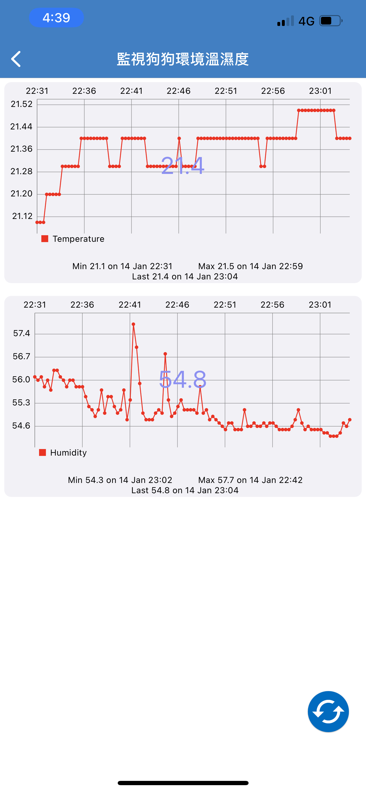

# dht22thingspeak
<h1>監視狗狗環境溫濕度</h1>
<h3>因家中狗狗年紀大體抗力下降，導致對環境敏感而過敏，所以即時需要監視環境中的溫溼度，再透過自動監視開啟智能除濕機或冷氣等。</h3>

<h2>Environments and Tools</h2>

<h3>1.Hardware</h3>

 - Raspberry Pi4 Model B(4GB)
 - DHT22 Humidity and temperature sensor
 - 32GB Micro SD Card
 - 5V 3A PSU USB C UK Plug
 - SOLDERLESS BREADBOARD MB-102

<h2>how to set your DHT22  Humidity and temperature sensor</h2>

https://www.labno3.com/2021/03/21/raspberry-pi-humidity-sensor-using-the-dht22/

<h3>Environment</h3>
  <tr><td bgcolor=#3C3C3C>  
 
   - Raspberry Os
 
   - Python 3.7 
 
 </td></tr>
   
   
   <h5> Install</h5> 
<tr><td bgcolor=#3C3C3C>  
 
        sudo apt-get update
 
        sudo apt-get install python3-pip
 
        sudo apt-get install python3-dev python3-pip
 
        sudo python3 -m pip install --upgrade pip setuptools wheel

 
 </td></tr>
 
  <h5> Install Adafruit_DHT</h5> 
<tr><td bgcolor=#3C3C3C>  
 
        sudo pip3 install Adafruit_DHT
 
 </td></tr>
 

   <h5> How to I Send data to thingspeak</h5> 
<tr><td bgcolor=#3C3C3C>  
 
       https://makerpro.cc/2021/01/upload-esp32-information-cloud-storage/

 </td></tr>

  <h5>Python</h5> 
  
  
  
<tr><td bgcolor=#3C3C3C>  
 
      from gpiozero import Buzzer
 
      import Adafruit_DHT
 
      from time import time, sleep
 
      from urllib.request import urlopen
 
      import sys
 
      WRITE_API = "NMTQCB43E4AFDVDX" # Replace your ThingSpeak API key here//(ThingSpeak   WRITE API 
      KEY)
 
      BASE_URL = "https://api.thingspeak.com/update?api_key={}".format(WRITE_API)  
     
      buzzer = Buzzer(26)
 
      SENSOR_PIN = 4 //GPIO
 
      SENSOR_TYPE = Adafruit_DHT.DHT22
 
      SensorPrevSec = 0
 
      SensorInterval = 2 # 2 seconds
 
      ThingSpeakPrevSec = 0
 
      ThingSpeakInterval = 20 # 20 seconds
 
 
      try:
 
          while True:
 
             if time()- SensorPrevSec > SensorInterval:
 
                 SensorPrevSec = time()
 
                 humidity, temperature = Adafruit_DHT.read_retry(SENSOR_TYPE, SENSOR_PIN)
 
                 print("Humidity = {:.2f}%\tTemperature = {:.2f}C".format(humidity, temperature))
 
 
             if time()- ThingSpeakPrevSec > ThingSpeakInterval:
 
                 ThingSpeakPrevSec = time()
 
                  thingspeakHttp = BASE_URL + "&field1={:.2f}&field2={:.2f}".format(temperature, 
                  humidity)
 
                  print(thingspeakHttp)
 
                  conn = urlopen(thingspeakHttp)
 
                  print("Response: {}".format(conn.read()))
      
                  conn.close()
 
                   buzzer.beep(0.05, 0.05, 1)
 
               sleep(1)
 
      except KeyboardInterrupt:
 
       conn.close()

 </td></tr>
 
 
 
  <h3> Bugs fix reference </h3> 
    <tr><td bgcolor=#3C3C3C>  
 
     https://www.cnblogs.com/hilary0614/p/dht11.html
     https://www.coder.work/article/7495902
     https://stackoverflow.com/questions/63232072/cannot-import-name-beaglebone-black-driver-from-adafruit-dht
     https://blog.csdn.net/weixin_45178126/article/details/120829198
     https://www.cnblogs.com/hilary0614/p/dht11.html
     https://zhuanlan.zhihu.com/p/98079246
     https://askubuntu.com/questions/96967/how-do-i-fix-this-e-type-is-not-known-on-line-in-source-list-update

 </td></tr>

<h3> Program reference </h3> 
    <tr><td bgcolor=#3C3C3C>  
 
    https://ithelp.ithome.com.tw/articles/10238029
    https://www.w3study.wiki/a/202108/722664.html
    http://hackpi.fun/raspberry-pi/Linux/raspberry-pi-humidity-sensor-dht22/
    https://kingfff.blogspot.com/2018/05/raspberry-pi-3-model-bdht22.html
    https://www.itread01.com/content/1546493605.html
    https://thingsboard.io/docs/samples/raspberry/temperature/

 </td></tr>
 
  <h3> Thingspeak Channel and Line Notify</h> 
    
     https://youyouyou.pixnet.net/blog/post/120275941?fbclid=IwAR237iKA8VWbrkMYDT3d3Nf7UFdCB05fLDDCUmUu44nE6ZlOQRfIXeol76s
  
  <tr><td bgcolor=#3C3C3C>  
  <h2>監視狗狗溫溼度環境 - Channel</h2>
 
  

  <h2>監視狗狗溫溼度環境 - ThingHTTP</h2>
 
  
 
  
 
  <h2>監視狗狗溫溼度環境 - React</h2>
 
   
   
  <h2>溫溼度Line Notify通知 - 濕度大於70%通知 </h2>
 
   
 
   <h2>溫溼度Line Notify通知 - 溫度大於30度通知</h2>
 
   
 
 
</td></tr>
 
 <h3>Thingview</h3>
  <tr><td bgcolor=#3C3C3C>  
 
 
 
 

 </td></tr>
   
 
 <h3>Future applications </h3> 
  <tr><td bgcolor=#3C3C3C>  
 
     因剛學習IoT及Python很多都不太會，這次因老師課程作業開始自學以及購買書籍學習，發現有很多領域都可以使用，
     此次原本計畫是透過Thingspeak MQTT Device，但因時間關係沒能成功....
     後續專案能結合智能除濕機以及空氣清淨機，若家中有小孩跟毛小孩能自行開發並運用IoT技術來達到自動偵測開啟智能家電，可以降低過敏源，再次感謝老師。

 </td></tr>
    
